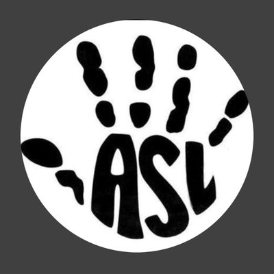

 
 
 

# ASL-T

## Overview
ASL-T is a data science project that would be used to help translate American Sign Language into the alphabet to make it easier to communicate. The input of this project would be an image and based on the input image, the output would be one of the twenty six letters or maybe nothing if the image is invalid(Doesn’t have a valid ASL sign.)  

## Dataset
As for the dataset that we will be using to train our model is taken from [Kaggle’s ASL dataset].

[Kaggle’s ASL dataset]: https://www.kaggle.com/grassknoted/asl-alphabet?

## Demo

## Future Development

## Contributors
- [Michelle Lucero]
- [Xuejin Gao]

[Michelle Lucero]: https://github.com/MichelleLucero
[Xuejin Gao]: https://github.com/xuejingao
